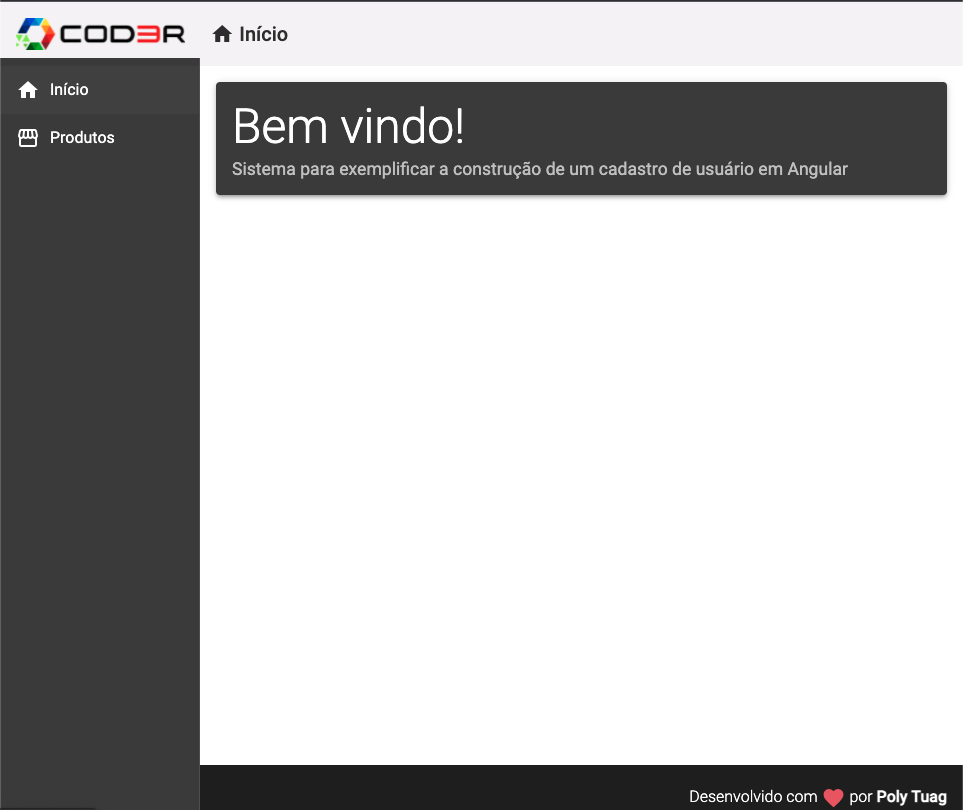

<div align="center">
  <h1>Sistema CRUD em Angular</h1>
  
</div>

<h3 align="center">  
  <p align="center">
    <a href="#-sobre">Sobre</a>&nbsp;&nbsp;&nbsp;|&nbsp;&nbsp;&nbsp;
    <a href="#-tecnologias">Tecnologias</a>&nbsp;&nbsp;&nbsp;|&nbsp;&nbsp;&nbsp;
    <a href="#-como-executar">Como Executar</a>&nbsp;&nbsp;&nbsp;|&nbsp;&nbsp;&nbsp;
    <a href="#-licença">Licença</a>
  </p>
</h3>

## 📚 Sobre

O projeto tem como objetivo, o estudo e a construção de uma aplicação CRUD(Create, Read, Update e Delete) em Angular.

## 🚀 Tecnologias utilizadas:

- Angular
- Typescript
- NodeJs
- Json Server
  
## ⏱ Como executar

Primeiramente, clone o repositório:
```
$ git clone https://github.com/polyanetuag/crud-angular.git
```
Nele, há duas pastas: Backend e Frontend

- Para executar a pasta Backend:

```bash
# Entre na pasta backend
$ cd backend

# Instale as dependências
$ yarn 

# Inicie o servidor
$ yarn start
```
- Para executar a pasta Frontend:

```bash
# Entre na pasta frontend
$ cd frontend

# Instale as dependências
$ yarn 

# Inicie o servidor
$ yarn start
```

Depois, abra http://localhost:4000 com seu navegador para ver o resultado.

## 📝 Licença

Esse projeto está sob a licença MIT.

---
Desenvolvido com 💜 por Polyane Tuag